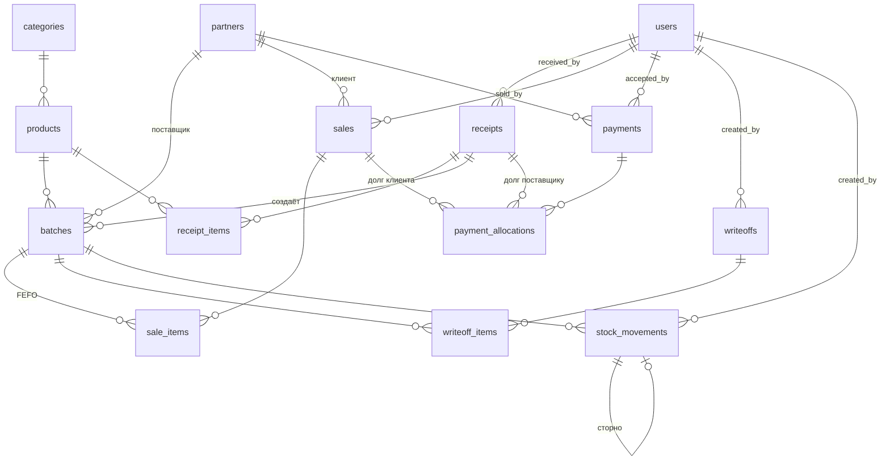

# Схема базы данных для MVP

Составлена под логику из [РАСЧЁТЫ.md](../wirehouse-front/РАСЧЁТЫ.md). Ориентир — PostgreSQL,
но всё переносится на MySQL заменой типов.

## Общие правила

| Правило | Как реализуется |
| --- | --- |
| Деньги никогда не `float` | `numeric(18,2)` для сумов, `numeric(14,2)` для долларов |
| Курс — четыре знака | `numeric(12,4)`, сумов за 1 доллар |
| Количество — три знака | `numeric(14,3)`, хватает и для кг, и для коробок |
| Валюта — перечисление | `currency_code` = `('UZS','USD')` |
| Курсов два — покупка и продажа | применяется тот, что выгоден складу; разница = доход от обмена |
| Курс живёт в документе | у каждого документа своя копия, справочник его не переписывает |
| Остаток нигде не хранится | считается из `stock_movements` |
| Долг нигде не хранится | считается из `sales` минус `payment_allocations` |
| Производные величины не хранятся | курсовая разница, доход от обмена и уступка считаются запросом из курсов, сохранённых в документе |
| Удалений нет | документы не удаляются, а сторнируются (`status = 'cancelled'`) |

```sql
CREATE TYPE currency_code   AS ENUM ('UZS', 'USD');
CREATE TYPE user_role       AS ENUM ('admin', 'manager', 'seller');
CREATE TYPE doc_status      AS ENUM ('draft', 'posted', 'cancelled');
CREATE TYPE movement_type   AS ENUM ('in', 'out', 'writeoff', 'adjust');
CREATE TYPE payment_method  AS ENUM ('cash', 'card', 'transfer');
CREATE TYPE payment_dir     AS ENUM ('in', 'out');
CREATE TYPE unit_code       AS ENUM ('box', 'bucket', 'kg', 'pcs', 'l');
CREATE TYPE rate_kind       AS ENUM ('buy', 'sell');
```

---

# 1. Справочники

## 1.1. `users` — сотрудники

| Поле | Тип | Обяз. | Описание |
| --- | --- | --- | --- |
| `id` | bigserial PK | ✔ | |
| `name` | text | ✔ | ФИО |
| `login` | text UNIQUE | ✔ | логин для входа |
| `password` | text | ✔ | bcrypt/argon2, никогда не открытый пароль |
| `role` | user_role | ✔ | `admin` / `manager` / `seller` |
| `phone` | text | | |
| `is_active` | boolean | ✔ | `false` = доступ закрыт, но история остаётся |
| `created_at` | timestamptz | ✔ | `default now()` |

## 1.2. `exchange_rates` — курс по дням, два значения

| Поле | Тип | Обяз. | Описание |
| --- | --- | --- | --- |
| `rate_date` | date PK | ✔ | одна строка на день |
| `rate_buy` | numeric(12,4) | ✔ | **курс покупки** — по нему мы принимаем доллар от клиента |
| `rate_sell` | numeric(12,4) | ✔ | **курс продажи** — по нему клиент гасит долларовый долг сумами |
| `created_by` | bigint FK → users | | кто поставил |
| `created_at` | timestamptz | ✔ | |

Ограничение: `CHECK (rate_sell >= rate_buy)` — продажа не может быть дешевле покупки.

Курс дня — **справочное** значение. В документ копируется при проведении, и последующее
изменение справочника на проведённые документы не влияет (сценарий 4.1).

### Если строки на нужную дату нет

Выходные, праздники, просто забыли внести. Проведение при этом блокировать нельзя — в
субботу тоже отгружают. Правило:

| Ситуация | Что делает система |
| --- | --- |
| Строка на `doc_date` есть | берёт её |
| Строки нет, но есть более ранняя не старше **7 дней** | берёт последнюю известную |
| Последней известной больше 7 дней | проведение запрещено, просит внести курс |

```sql
SELECT rate_buy, rate_sell FROM exchange_rates
WHERE rate_date <= :doc_date AND rate_date > :doc_date - 7
ORDER BY rate_date DESC LIMIT 1;
```

Подставленный курс попадает в документ снимком, как обычно, поэтому задним числом ничего
не поедет, даже если курс на ту дату внесут позже. Семь дней — предохранитель: месячный
простой справочника не должен тихо оценивать сентябрьские отгрузки по августовскому курсу.

## 1.2.1. Какой курс когда применяется

Правило одно и работает в обе стороны: **применяется тот курс, который выгоден складу**.
Разница между двумя курсами и есть заработок на обмене.

| Ситуация | Направление | Курс | Почему |
| --- | --- | --- | --- |
| Товар долларовый, клиент платит **сумами** | USD → UZS | **`rate_sell`** | мы как бы продаём ему доллары, чтобы он закрыл долларовый долг |
| Товар сумовой, клиент платит **долларами** | UZS → USD | **`rate_buy`** | мы покупаем у него доллары, чтобы закрыть сумовой долг |
| Товар долларовый, платит долларами | — | курс не нужен | конвертации нет |
| Товар сумовой, платит сумами | — | курс не нужен | конвертации нет |
| Приход импортного товара (себестоимость в сумах) | USD → UZS | **`rate_buy`** | во столько нам обошёлся доллар, который мы отдали поставщику |
| Оценка склада и отчёты | USD → UZS | **`rate_buy`** | консервативно: не завышаем стоимость запасов |

Проверим на числах. Пусть на 1 сентября: **покупка 13 000**, **продажа 13 200**.

**Случай 1 — долларовый товар, платит сумами.**

```
Долг:            $225
Курс продажи:    13 200
Клиент платит:   225 × 13 200 = 2 970 000 сўм
```

Если бы взяли курс покупки, клиент отдал бы 2 925 000 — на 45 000 меньше.

**Случай 2 — сумовой товар, платит долларами.**

```
Долг:            1 300 000 сўм
Курс покупки:    13 000
Клиент платит:   1 300 000 / 13 000 = $100,00
```

Если бы взяли курс продажи, хватило бы $98,48 — на полтора доллара меньше.

В обоих случаях разница в вашу пользу. Это **не прибыль от товара**, а доход от обмена, и
показывается он отдельной статьёй (считается запросом, см. 3.6).

## 1.2.2. Из чего складывается разница с оценкой

Одна оплата может отличаться от суммы в накладной сразу по трём причинам. Их надо
разделять, иначе непонятно, за счёт чего вышли деньги.

**Ни одна из трёх величин в базе не хранится.** В платеже лежат курсы — применённый и оба
справочных, — и этого достаточно, чтобы посчитать любую из них запросом в любой момент.

Пусть накладная от 1 августа на **$225**, курсы тогда: покупка 12 500, продажа 12 700.
Клиент платит сумами 1 сентября, курсы: покупка 13 000, продажа 13 200.

```
Оценка накладной (по rate_buy 1 августа):   225 × 12 500 = 2 812 500 сўм
Фактически получено (по rate_sell 1 сент.): 225 × 13 200 = 2 970 000 сўм
Разница:                                                     157 500 сўм
```

Раскладывается ровно на две части:

```
Курсовая разница (время):  225 × (13 000 − 12 500) = 112 500   ← покупка сент. минус покупка авг.
Доход от обмена (спред):   225 × (13 200 − 13 000) =  45 000   ← продажа минус покупка на день оплаты
                                                     -------
                                                      157 500  ✔
```

Обе части отсчитываются **от курса покупки**, потому что по нему же сделана оценка
накладной. Точка отсчёта одна, поэтому части всегда складываются в разницу без остатка:

```
(pay_buy − sale_buy) + (pay_sell − pay_buy) = pay_sell − sale_buy
```

Если курсовую разницу считать от курса продажи накладной, тождество ломается, как только
спред между двумя датами изменится, и часть суммы повисает в воздухе.

Третья возможная часть — **уступка**, если продавец применил курс не из справочника
(сценарий 4.2). Тогда она вычитается из дохода от обмена.

> Если понадобится ещё и курс ЦБ для бухгалтерской отчётности — добавляется третья колонка
> `rate_cb`, а оценка склада переводится на неё. Структура не меняется.

## 1.3. `categories` — категории товара

| Поле | Тип | Обяз. | Описание |
| --- | --- | --- | --- |
| `id` | bigserial PK | ✔ | |
| `slug` | text UNIQUE | ✔ | `margarine`, `condensed`, `filling`, `butter`, `oil` |
| `name` | text | ✔ | отображаемое название |
| `sort_order` | int | | порядок в списках |

## 1.4. `products` — номенклатура

| Поле | Тип | Обяз. | Описание |
| --- | --- | --- | --- |
| `id` | bigserial PK | ✔ | |
| `sku` | text UNIQUE | ✔ | артикул |
| `name` | text | ✔ | |
| `category_id` | bigint FK → categories | ✔ | |
| `currency` | currency_code | ✔ | **валюта прайса** — от неё зависит валюта продажи и долга |
| `unit` | unit_code | ✔ | единица учёта остатка: коробка, ведро, кг |
| `pack_qty` | numeric(14,3) | ✔ | сколько `pack_unit` в одной единице учёта |
| `pack_unit` | unit_code | ✔ | кг или шт внутри коробки |
| `shelf_life_days` | int | ✔ | срок годности от даты производства |
| `min_stock` | numeric(14,3) | ✔ | порог «пора закупать» |
| `purchase_price` | numeric(14,2) | ✔ | ориентир закупки в валюте прайса |
| `sale_price` | numeric(14,2) | ✔ | цена продажи в валюте прайса |
| `is_active` | boolean | ✔ | |

`purchase_price` здесь — только подсказка при вводе прихода. Реальная себестоимость всегда
берётся из партии.

## 1.5. `partners` — клиенты и поставщики

| Поле | Тип | Обяз. | Описание |
| --- | --- | --- | --- |
| `id` | bigserial PK | ✔ | |
| `is_customer` | boolean | ✔ | покупает у нас |
| `is_supplier` | boolean | ✔ | продаёт нам |
| `name` | text | ✔ | |
| `contact` | text | | контактное лицо |
| `phone` | text | | |
| `address` | text | | |
| `currency` | currency_code | | **для поставщика** — в чём выставляет счёт |
| `credit_limit_uzs` | numeric(18,2) | | **для клиента**, всегда в сумах |
| `is_active` | boolean | ✔ | |

Ограничение: `CHECK (is_customer OR is_supplier)` — контрагент без роли не нужен.

Два флага, а не одно поле `type`, потому что **один и тот же контрагент бывает и клиентом,
и поставщиком** — берёт у вас маргарин и продаёт вам подсолнечное масло. С перечислением
пришлось бы заводить две карточки, и долг разъехался бы по двум балансам: вы должны ему,
он должен вам, а зачесть нельзя.

Валюты долга у клиента **нет**: долг возникает в валюте товара. Поэтому лимит один и в
сумах — долг бывает сразу в двух валютах, и сравнивать его можно только через курс.
Проверка лимита при отгрузке идёт по **курсу покупки текущего дня**, тому же, по которому
оценивается склад:

```
debt_uzs + debt_usd × rate_buy(сегодня) <= credit_limit_uzs
```

Курс дня, а не курс накладной: лимит отвечает на вопрос «сколько он должен прямо сейчас».

---

# 2. Партии

## 2.1. `batches` — партия товара

| Поле | Тип | Обяз. | Описание |
| --- | --- | --- | --- |
| `id` | bigserial PK | ✔ | |
| `number` | text | ✔ | номер партии, уникален в паре с `product_id` |
| `product_id` | bigint FK → products | ✔ | |
| `produced_at` | date | ✔ | дата производства |
| `expires_at` | date | ✔ | годен до — по нему работает FEFO |
| `received_at` | date | ✔ | дата поступления на склад |
| `initial_qty` | numeric(14,3) | ✔ | сколько пришло (остаток считается из движений) |
| `purchase_price` | numeric(14,2) | ✔ | цена закупки **в валюте прихода** |
| `currency` | currency_code | ✔ | валюта закупки — от неё зависит валюта прибыли |
| `rate` | numeric(12,4) | ✔ | курс на дату прихода, зафиксирован навсегда; **у сумовой партии равен 1** |
| `cost_base_uzs` | numeric(18,2) | ✔ | `purchase_price × rate` — себестоимость в сумах |
| `supplier_id` | bigint FK → partners | ✔ | |
| `receipt_id` | bigint FK → receipts | ✔ | документ, которым партия создана |

`rate` — это **коэффициент перевода в сумы**, а не «курс дня». Для долларовой партии он равен
курсу, для сумовой — единице, иначе `cost_base_uzs` превратится в бессмыслицу: 480 000 сўм,
умноженные на 12 700. Ограничение:

```sql
CHECK (currency <> 'UZS' OR rate = 1)
```

Курс дня, действовавший при сумовой закупке, отдельно не нужен: он ни во что не входит.
Если понадобится для отчёта, он есть в `receipts.official_buy`.

Партия — центральная сущность. В ней сходятся **срок годности** и **себестоимость с курсом**.
Из-за неё расчёт по одной цене закупки на товар даёт ошибку (сценарий 3.4).

Индексы: `(product_id, expires_at)` — под FEFO, `(expires_at)` — под отчёт по срокам.

---

# 3. Документы

## 3.0. Что общего у всех документов

В каждом документе есть **три даты** и **автор**. Их легко перепутать, поэтому один раз
проговорим:

| Поле | Что означает | Пример |
| --- | --- | --- |
| `doc_date` | дата самого документа — её ставит пользователь | накладная задним числом от 28 июля |
| `posted_at` | момент проведения: когда движения ушли на склад | 2 августа в 14:35 |
| `created_at` | когда запись появилась в базе | 2 августа в 14:33 |

Автор в каждом документе называется по роли, а не одинаковым `user_id`:

| Документ | Поле | Кто это |
| --- | --- | --- |
| `receipts` | `received_by` | товаровед, принявший товар |
| `sales` | `sold_by` | продавец, отгрузивший клиенту |
| `payments` | `accepted_by` | кто принял деньги |
| `writeoffs` | `created_by` | кто оформил списание |
| `stock_movements` | `created_by` | кто сделал операцию |

Так в отчёте «кто сколько отгрузил» и в журнале движений сразу видно, о какой роли речь,
без заглядывания в схему.

## 3.1. `receipts` — приход

| Поле | Тип | Обяз. | Описание |
| --- | --- | --- | --- |
| `id` | bigserial PK | ✔ | |
| `number` | text UNIQUE | ✔ | `ПР-01055` |
| `doc_date` | date | ✔ | |
| `posted_at` | timestamptz | | момент проведения |
| `supplier_id` | bigint FK → partners | ✔ | |
| `currency` | currency_code | ✔ | валюта расчётов с поставщиком |
| `rate` | numeric(12,4) | ✔ | применённый курс, по умолчанию `rate_buy` дня; **у сумового прихода равен 1** |
| `official_buy` | numeric(12,4) | ✔ | снимок `rate_buy` на дату — для контроля отклонения |
| `official_sell` | numeric(12,4) | ✔ | снимок `rate_sell` на дату |
| `total` | numeric(18,2) | ✔ | сумма в валюте документа |
| `total_base_uzs` | numeric(18,2) | ✔ | та же сумма в сумах по `rate` |
| `received_by` | bigint FK → users | ✔ | **кто принял товар** — товаровед |
| `created_at` | timestamptz | ✔ | когда документ внесли в систему |
| `status` | doc_status | ✔ | |
| `note` | text | | |

Приход одновалютный: поставщик выставляет счёт в одной валюте.

Курс по умолчанию — **`rate_buy`**: столько сумов стоил доллар, который вы отдали
поставщику. Товаровед может поставить фактический курс сделки, если доллары покупались
на рынке дороже, — тогда отклонение от `official_buy` останется видимым.

`rate` здесь тот же коэффициент перевода, что и в партии, с тем же ограничением
`CHECK (currency <> 'UZS' OR rate = 1)`. У сумового прихода `total_base_uzs = total`.

## 3.2. `receipt_items` — строки прихода

| Поле | Тип | Обяз. | Описание |
| --- | --- | --- | --- |
| `id` | bigserial PK | ✔ | |
| `receipt_id` | bigint FK → receipts | ✔ | `on delete cascade` |
| `product_id` | bigint FK → products | ✔ | |
| `batch_id` | bigint FK → batches | ✔ | партия, созданная этой строкой |
| `qty` | numeric(14,3) | ✔ | |
| `price` | numeric(14,2) | ✔ | в валюте документа |
| `total` | numeric(18,2) | ✔ | `qty × price` |

Одна строка прихода = одна новая партия. Всегда.

## 3.3. `sales` — отгрузка

| Поле | Тип | Обяз. | Описание |
| --- | --- | --- | --- |
| `id` | bigserial PK | ✔ | |
| `number` | text UNIQUE | ✔ | `РН-03345` |
| `doc_date` | date | ✔ | |
| `posted_at` | timestamptz | | |
| `customer_id` | bigint FK → partners | ✔ | |
| `rate_buy` | numeric(12,4) | ✔ | снимок курса покупки на дату — по нему считается оценка и от него отсчитывается курсовая разница |
| `rate_sell` | numeric(12,4) | ✔ | снимок курса продажи на дату — справочный, в формулах не участвует |
| `total_usd` | numeric(14,2) | ✔ | **итог долларовых позиций** |
| `total_uzs` | numeric(18,2) | ✔ | **итог сумовых позиций** |
| `total_base_uzs` | numeric(18,2) | ✔ | `total_uzs + total_usd × rate_buy` — для отчётов |
| `sold_by` | bigint FK → users | ✔ | **кто отгрузил** — продавец |
| `created_at` | timestamptz | ✔ | когда документ внесли в систему |
| `status` | doc_status | ✔ | |
| `note` | text | | |

**Валюты у накладной нет** — есть два итога. Смешанная накладная это норма (сценарий 1.5),
и каждый итог порождает свой долг.

Рабочий из двух курсов — `rate_buy`: по нему накладная оценивается в отчёте и от него же
отсчитывается курсовая разница, когда клиент рассчитается сумами через месяц. `rate_sell`
хранится снимком просто как состояние справочника на дату отгрузки — ни в одну формулу он
не входит, но без него нельзя восстановить, какую пару курсов видел продавец.

## 3.4. `sale_items` — строки отгрузки

| Поле | Тип | Обяз. | Описание |
| --- | --- | --- | --- |
| `id` | bigserial PK | ✔ | |
| `sale_id` | bigint FK → sales | ✔ | `on delete cascade` |
| `product_id` | bigint FK → products | ✔ | |
| `batch_id` | bigint FK → batches | ✔ | партия, выбранная по FEFO |
| `qty` | numeric(14,3) | ✔ | |
| `price` | numeric(14,2) | ✔ | цена в валюте товара |
| `currency` | currency_code | ✔ | валюта строки = валюта товара |
| `total` | numeric(18,2) | ✔ | `qty × price` |
| `cost_price` | numeric(14,2) | ✔ | **снимок** закупочной цены партии |
| `cost_currency` | currency_code | ✔ | **снимок** валюты закупки |
| `cost_rate` | numeric(12,4) | ✔ | **снимок** `batches.rate` — коэффициент перевода в сумы, у сумовой партии `1` |

Три `cost_*` — самое важное в этой таблице. Прибыль строки считается из них:

```
выручка_в_валюте_закупки = total, приведённая к cost_currency по sales.rate_buy
прибыль = выручка_в_валюте_закупки − qty × cost_price      (в cost_currency)
```

### Пример 1. Обычная строка, одна партия

Продали 20 коробок маргарина по $45. Ушла партия A, купленная за $38.

| поле | значение |
| --- | --- |
| `qty` | 20 |
| `price` | 45,00 |
| `currency` | `USD` |
| `total` | 900,00 |
| `cost_price` | 38,00 |
| `cost_currency` | `USD` |
| `cost_rate` | 12 500 |

```
прибыль = 900 − 20 × 38 = $140
```

Курс не участвует: и продали, и купили в долларах.

### Пример 2. Одна позиция из двух партий — две строки

Тот же маргарин, но продали 25 коробок, а в партии A осталось только 20. По FEFO
остальные 5 уходят из партии B, купленной **за сумы** у местного поставщика по 480 000.

Курс накладной `rate_buy` = 12 900.

| | строка 1 | строка 2 |
| --- | --- | --- |
| `product_id` | маргарин | **тот же маргарин** |
| `batch_id` | партия A | партия B |
| `qty` | 20 | 5 |
| `price` | 45,00 | 45,00 |
| `currency` | `USD` | `USD` |
| `total` | 900,00 | 225,00 |
| `cost_price` | 38,00 | 480 000 |
| `cost_currency` | `USD` | **`UZS`** |
| `cost_rate` | 12 500 | **1** |

```
Строка 1:  900 − 20 × 38 = $140

Строка 2:  выручка в сумах: 225 × 12 900 = 2 902 500
           себестоимость:     5 × 480 000 = 2 400 000
           прибыль:                          502 500 сўм
```

Прибыль по документу: **$140 и 502 500 сўм**. Один и тот же товар в одной накладной дал
прибыль в двух разных валютах — потому что партии куплены по-разному. Сложить их можно
только через курс: 140 × 12 900 + 502 500 = **2 308 500 сўм**.

Вот почему одна позиция из двух партий обязана быть **двумя строками**: у них разная
себестоимость, разная валюта закупки и даже разная валюта прибыли.

### Пример 3. Зачем снимок, а не ссылка на партию

Допустим, `sale_items` хранил бы только `batch_id`, а цену закупки брал из `batches`.

```
1 августа:  продали 20 кор, партия A по $38 → прибыль $140
            директор видит в отчёте за август: $140

5 сентября: товаровед находит опечатку в приходе — было не $38, а $39,
            правит партию A

Теперь тот же отчёт за август показывает: 20 × (45 − 39) = $120
```

Отчёт за закрытый месяц изменился сам собой. Со снимком `cost_price = 38` он остаётся
таким, каким был: исправление партии повлияет только на будущие отгрузки.

То же самое с `cost_rate`: если кто-то поправит курс в старом приходе, себестоимость в
сумах по всем прошлым продажам не поедет.

### Зачем нужен каждый из трёх снимков

| Поле | Зачем |
| --- | --- |
| `cost_price` | сама себестоимость единицы — база расчёта прибыли |
| `cost_currency` | определяет, **в какой валюте** получится прибыль по этой строке |
| `cost_rate` | себестоимость в сумах = `cost_price × cost_rate` — для оценки склада и потерь. У сумовой партии равен `1`, поэтому формула работает без ветвления |

## 3.5. `payments` — оплаты

| Поле            | Тип                  | Обяз. | Описание |
|-----------------|----------------------| --- | --- |
| `id`            | bigserial PK         | ✔ | |
| `number`        | text UNIQUE          | ✔ | `ОП-00871` |
| `doc_date`      | date                 | ✔ | |
| `posted_at`     | timestamptz          | | |
| `supplier_id`   | bigint FK → supplier | ✔ | |
| `amount`        | numeric(18,2)        | ✔ | сумма в валюте платежа |
| `currency`      | currency_code        | ✔ | **чем заплатил** |
| `rate_kind`     | rate_kind            | | заполнено только при конвертации |
| `rate`          | numeric(12,4)        | | применённый курс, только при конвертации |
| `method`        | payment_method       | ✔ | наличные / карта / перечисление |
| `accepted_by`   | bigint FK → users    | ✔ | **кто принял деньги** |
| `created_at`    | timestamptz          | ✔ | когда документ внесли в систему |
| `status`        | doc_status           | ✔ | |
| `note`          | text                 | | |

`status` у платежа обязателен ровно по той же причине, что и у остальных документов:
принятый по ошибке платёж уже переписал долг клиента, и удалить его нельзя. Отмена — это
`status = 'cancelled'`; строки разнесения при этом **остаются на месте**, но перестают
учитываться, потому что все расчёты долга фильтруют платежи по `posted`.

`rate_kind` однозначно выводится из валюты платежа и не требует выбора руками:

| Платит | Гасит долг в | Конвертация | `rate_kind` |
| --- | --- | --- | --- |
| сумами | сумах | нет | `NULL` |
| сумами | долларах | USD → UZS | **`sell`** |
| долларами | долларах | нет | `NULL` |
| долларами | сумах | UZS → USD | **`buy`** |

Поэтому одного поля `rate` на платёж достаточно: платёж в одной валюте всегда конвертирует
только в одну сторону. Отклонение `rate` от соответствующего `official_*` — это уступка.

`rate` и `rate_kind` необязательны и заполняются **вместе**: когда конвертации нет, там
`NULL`, а не курс «на всякий случай» — иначе непонятно, применялся он или лежит для вида.

```sql
CHECK ((rate IS NULL) = (rate_kind IS NULL))
```

Одна оплата может гасить долги обеих валют сразу (сценарий 2.4). Конвертация при этом
всё равно одна: сумовая часть закрывается без курса, долларовая — по `rate`.

Ссылки на накладную в самом платеже нет: «оплата сразу по накладной» — это просто платёж
с одной строкой разнесения. Дублирующее поле рано или поздно разошлось бы с
`payment_allocations`, как и любое хранимое повторение (раздел 5).

## 3.6. `payment_allocations` — разнесение платежа по накладным

Ключевая таблица всей денежной части. Пишется при проведении платежа и фиксирует, что
именно он закрыл.

| Поле | Тип | Обяз. | Описание |
| --- | --- | -- | --- |
| `id` | bigserial PK | ✔ | |
| `payment_id` | bigint FK → payments | ✔ | |
| `sale_id` | bigint FK → sales | | какую накладную закрывает — у платежа от клиента |
| `receipt_id` | bigint FK → receipts | | какой приход закрывает — у платежа поставщику |
| `currency` | currency_code | ✔ | какой из двух долгов документа |
| `amount_closed` | numeric(18,2) | ✔ | сколько закрыто, **в валюте долга** |
| `amount_spent` | numeric(18,2) | ✔ | сколько на это ушло, в валюте платежа |
| `doc_rate` | numeric(12,4) | ✔ | снимок `rate_buy` документа — курс, по которому он оценён |
| `pay_rate` | numeric(12,4) |  | применённый курс оплаты |
| `is_rounding` | boolean | ✔ | `true` — это автозачёт хвоста меньше 1000 сўм |

Строка указывает ровно на один документ — накладную или приход:

```sql
CHECK ((sale_id IS NULL) <> (receipt_id IS NULL))
```

Поэтому `direction = 'out'` не остаётся полем без применения: платёж поставщику разносится
по приходам той же таблицей и теми же правилами. Долг перед поставщиком считается так же,
как долг клиента, — из документов минус разнесения.

Порядок разнесения: **сначала долг в валюте платежа, старые документы первыми**, потом
вторая валюта через курс платежа (сценарий 2.4).

Одна оплата обычно даёт несколько строк: одну на каждую пару «документ + валюта».

### Ведущая величина — `amount_spent`

Из двух сумм в строке первична та, что в валюте платежа: это реальные деньги, которые
прошли через руки. `amount_closed` — производная от неё по `pay_rate`, округлённая до двух
знаков.

```
SUM(amount_spent) по платежу  <=  payments.amount
```

Неравенство, а не равенство: **разница — это аванс**. Клиент заплатил больше текущего
долга или заплатил вперёд — остаток просто не разнесён. Отдельной таблицы под авансы нет и
не нужно: когда появится накладная, к тому же платежу дописывается ещё одна строка
разнесения. Ничего не переписывается, история не мутирует.

Обратный пересчёт `amount_closed × pay_rate` делать нельзя — он не вернёт `amount_spent`
из-за округления (сценарий 4.3). Именно на этой невязке и возникает хвост.

### Курсовая разница, доход от обмена и уступка

Колонок под них нет. Все три считаются **отчётом, а не при проведении** — из `doc_rate`,
`pay_rate` и снимка справочной пары в платеже. Причина простая: это производные величины,
и хранить их значит зафиксировать в данных формулу, которая ещё может уточниться. Пока
хранятся курсы, любое уточнение пересчитывает всю историю само.

Точка отсчёта у всех одна — **курс покупки**, тот же, по которому оценена накладная
(см. 1.2.2). Ниже `a` — строка разнесения, `p` — платёж.

```sql
-- клиент платит сумами, гасится долларовый долг    (pay_rate — вид 'sell')
fx_diff_uzs    = a.amount_closed * (p.official_buy  - a.doc_rate)
spread_uzs     = a.amount_closed * (p.official_sell - p.official_buy)
concession_uzs = a.amount_closed * (p.official_sell - a.pay_rate)

-- клиент платит долларами, гасится сумовой долг     (pay_rate — вид 'buy')
fx_diff_uzs    = 0                                   -- сумовой долг не переоценивается
spread_uzs     = a.amount_spent  * (p.official_sell - p.official_buy)
concession_uzs = a.amount_spent  * (a.pay_rate      - p.official_buy)

-- валюта платежа совпала с валютой долга
fx_diff_uzs = 0, spread_uzs = 0, concession_uzs = 0
```

Проверка на примере из 1.2.2 (накладная $225, оплата сумами через месяц):

```
amount_closed  = 225
doc_rate       = 12 500   (rate_buy на дату накладной)
official_buy   = 13 000   official_sell = 13 200   pay_rate = 13 200

fx_diff_uzs    = 225 × (13 000 − 12 500) = 112 500
spread_uzs     = 225 × (13 200 − 13 000) =  45 000
concession_uzs = 225 × (13 200 − 13 200) =       0
                                           -------
получено сверх оценки накладной            157 500  ✔
```

Хвост округления (`is_rounding = true`) закрывает долг, на который денег не поступало:
у такой строки `amount_spent = 0`. Сумма `amount_closed` по строкам с `is_rounding` — и
есть потеря на округлении, отдельной колонки она тоже не требует.

Порог один и задан в сумах — 1000. Долларовый хвост сравнивается с ним через курс покупки
дня оплаты, а не отдельным долларовым порогом:

```
UZS:  amount_closed                   < 1000
USD:  amount_closed × official_buy    < 1000
```

Иначе пришлось бы держать две константы и следить, чтобы они не разъехались при росте
курса.

### Как это работает на живом платеже

Разберём целиком: что лежит в базе до платежа, что делает алгоритм и какие строки
появляются.

**Было.** У «Хамкор Нон» два непогашенных документа:

| Накладная | Дата | Долг | `rate_buy` документа |
| --- | --- | --- | --- |
| РН-001 | 1 августа | **$75** и **420 000 сўм** | 12 500 |
| РН-002 | 10 августа | **$50** | 12 600 |

**Стало.** 1 сентября курсы: покупка 13 000, продажа 13 200. Клиент приносит
**2 069 900 сўм**.

Запись в `payments`: `amount = 2 069 900`, `currency = 'UZS'`, `rate_kind = 'sell'`,
`rate = 13 200`, `official_buy = 13 000`, `official_sell = 13 200`.

**Алгоритм разнесения.** Сначала долги в валюте платежа, старые документы первыми; потом
вторая валюта через `rate`.

```
Шаг 1. Сумовые долги, старые первыми
       РН-001, 420 000 сўм — валюта совпала, конвертации нет
       осталось от платежа: 2 069 900 − 420 000 = 1 649 900

Шаг 2. Долларовые долги, старые первыми
       РН-001, $75 → нужно 75 × 13 200 = 990 000
       осталось: 1 649 900 − 990 000 = 659 900

Шаг 3. РН-002, $50 → нужно 660 000, а есть 659 900
       закрываем сколько хватает: 659 900 / 13 200 = $49,9924… → $49,99
       ушло: 49,99 × 13 200 = 659 868
       осталось: 32 сўм

Шаг 4. Остаток долга РН-002: 50 − 49,99 = $0,01
       в сумах: 0,01 × 13 000 = 130 < 1000 → хвост, гасим без денег
```

**Что записалось в `payment_allocations`:**

| # | документ | `currency` | `amount_closed` | `amount_spent` | `doc_rate` | `pay_rate` | `is_rounding` |
| --- | --- | --- | --- | --- | --- | --- | --- |
| 1 | РН-001 | UZS | 420 000,00 | 420 000,00 | 12 500 | — | false |
| 2 | РН-001 | USD | 75,00 | 990 000,00 | 12 500 | 13 200 | false |
| 3 | РН-002 | USD | 49,99 | 659 868,00 | 12 600 | 13 200 | false |
| 4 | РН-002 | USD | 0,01 | 0,00 | 12 600 | 13 200 | **true** |

Четыре строки на один платёж. Обе накладные закрыты полностью.

```
SUM(amount_spent) = 2 069 868  ≤  payments.amount = 2 069 900
разница 32 сўм — аванс, он просто не разнесён
```

**Почему `amount_spent` ведущая.** В строке 3 обратный пересчёт не сходится:
49,99 × 13 200 = 659 868, а из платежа ушло ровно столько же — но исходный остаток был
659 900. Считать «сколько ушло» из `amount_closed` нельзя, поэтому первична сумма в валюте
платежа, а `amount_closed` — производная от неё.

**Сходится ли всё.** Закрыто долга по оценке документов:

```
420 000 + 75 × 12 500 + 49,99 × 12 600 + 0,01 × 12 600 = 1 987 500 сўм
получено деньгами:                                       2 069 868 сўм
разница:                                                    82 368 сўм
```

Раскладывается по формулам выше без остатка:

```
курсовая разница   75 × (13 000 − 12 500) + 49,99 × (13 000 − 12 600) = 57 496
доход от обмена    (75 + 49,99) × (13 200 − 13 000)                   = 24 998
уступка            курс дня применён без отклонения                   =      0
потеря на хвосте   −0,01 × 12 600                                     =   −126
                                                                        ------
                                                                        82 368  ✔
```

**Как из этого получается долг.** Никакого хранимого поля: остаток по накладной — это её
итог минус сумма разнесений.

```sql
SELECT s.total_usd - COALESCE(SUM(a.amount_closed) FILTER (WHERE a.currency = 'USD'), 0),
       s.total_uzs - COALESCE(SUM(a.amount_closed) FILTER (WHERE a.currency = 'UZS'), 0)
FROM sales s
LEFT JOIN payment_allocations a ON a.sale_id = s.id
LEFT JOIN payments p ON p.id = a.payment_id AND p.status = 'posted'
WHERE s.id = :id
GROUP BY s.id;
```

Отменили платёж — `status` стал `cancelled`, строки разнесения остались на месте, но в
расчёт больше не попадают, и долг вернулся сам. Ничего пересчитывать и переписывать не
нужно.

> **Нестыковка, которую надо закрыть при реализации.** `pay_rate` помечен обязательным, но
> у платежа без конвертации `payments.rate` равен `NULL` (см. 3.5) — как в строке 1 примера
> выше. Либо `pay_rate` тоже делать необязательным, либо ограничение писать условным:
> `CHECK (currency = (SELECT currency FROM payments …) OR pay_rate IS NOT NULL)`. Проще
> первое: `pay_rate` заполняется только там, где курс реально применялся.

## 3.7. `writeoffs` и `writeoff_items` — списания

`writeoffs`

| Поле | Тип | Обяз. | Описание |
| --- | --- | --- | --- |
| `id` | bigserial PK | ✔ | |
| `number` | text UNIQUE | ✔ | `СП-00042` |
| `doc_date` | date | ✔ | |
| `reason` | text | ✔ | истёк срок, брак, повреждение |
| `created_by` | bigint FK → users | ✔ | **кто оформил списание** |
| `created_at` | timestamptz | ✔ | когда документ внесли в систему |
| `status` | doc_status | ✔ | |

`writeoff_items`

| Поле | Тип | Обяз. | Описание |
| --- | --- | --- | --- |
| `id` | bigserial PK | ✔ | |
| `writeoff_id` | bigint FK → writeoffs | ✔ | |
| `product_id` | bigint FK → products | ✔ | |
| `batch_id` | bigint FK → batches | ✔ | списываем всегда конкретную партию |
| `qty` | numeric(14,3) | ✔ | |
| `cost_base_uzs` | numeric(18,2) | ✔ | снимок потерь в сумах |

---

# 4. Журнал движений

## 4.1. `stock_movements` — единственный источник правды по остаткам

| Поле | Тип | Обяз. | Описание |
| --- | --- | --- | --- |
| `id` | bigserial PK | ✔ | |
| `occurred_at` | timestamptz | ✔ | когда произошло |
| `type` | movement_type | ✔ | `in` / `out` / `writeoff` / `adjust` |
| `product_id` | bigint FK → products | ✔ | |
| `batch_id` | bigint FK → batches | ✔ | движение всегда по конкретной партии |
| `qty` | numeric(14,3) | ✔ | **знаковое**: `+` товар пришёл на склад, `−` ушёл |
| `doc_type` | text | ✔ | `receipt` / `sale` / `writeoff` / `inventory` |
| `doc_id` | bigint | ✔ | id документа |
| `doc_number` | text | ✔ | копия номера — чтобы журнал читался без джойнов |
| `reverses_id` | bigint FK → stock_movements | | заполнено у сторно: какую строку отменяет |
| `partner_id` | bigint FK → partners | | у списания пусто |
| `created_by` | bigint FK → users | ✔ | кто сделал операцию |
| `note` | text | | причина для списания |

**Знак живёт в `qty`, а не выводится из `type`.** Это единственное место в схеме, где
количество бывает отрицательным: в строках документов (`receipt_items`, `sale_items`,
`writeoff_items`) `qty` всегда положительное. Причина в том, что `adjust` может двигать
остаток в обе стороны — отмена прихода убирает товар, отмена отгрузки возвращает, — и из
типа операции знак не восстановить.

Чтобы знак нельзя было проставить наугад, он привязан к типу ограничением:

```sql
CHECK (
  (type = 'in'       AND qty > 0)  OR   -- приход
  (type = 'out'      AND qty < 0)  OR   -- отгрузка
  (type = 'writeoff' AND qty < 0)  OR   -- списание
  (type = 'adjust'   AND qty <> 0)      -- сторно и инвентаризация — в обе стороны
)
```

Индексы: `(batch_id)`, `(product_id, occurred_at desc)`, `(doc_type, doc_id)`.

Записи в журнал **только добавляются**. Отмена документа не удаляет строки, а пишет на
каждую из них парную с типом `adjust`, тем же `qty` наоборот и ссылкой `reverses_id`.
`doc_type` и `doc_number` у сторно остаются от исходного документа — в журнале видно,
что именно отменили.

Одну строку нельзя сторнировать дважды:

```sql
CREATE UNIQUE INDEX ON stock_movements (reverses_id) WHERE reverses_id IS NOT NULL;
```

В MVP `adjust` всегда означает сторно и всегда имеет `reverses_id`. Когда появится
инвентаризация, её строки будут отличаться именно пустым `reverses_id`.

---

# 5. Что мы НЕ храним и почему

| Не храним | Как получаем | Почему так |
| --- | --- | --- |
| Остаток товара | `SUM` по `stock_movements` | хранимое число рано или поздно разъедется с журналом |
| Остаток партии | то же, с группировкой по `batch_id` | |
| Долг клиента | `sales.total_*` − `SUM(payment_allocations.amount_closed)` | долг двухвалютный, одно число его не описывает |
| Долг поставщику | `receipts.total` − то же по `receipt_id` | считается той же таблицей, приход одновалютный |
| Аванс контрагента | `payments.amount` − `SUM(amount_spent)` | это просто неразнесённый остаток, отдельная сущность не нужна |
| Оплачено по накладной | `SUM(payment_allocations)` по `sale_id` | иначе поле и разнесение начнут расходиться |
| Прибыль | из `sale_items.cost_*` | считается из снимка, менять нечего |
| Курсовая разница | из `doc_rate` и `payments.official_buy` | формула ещё может уточниться — пусть пересчитается вся история |
| Доход от обмена | из пары `official_sell − official_buy` в платеже | то же: курсы зафиксированы, число выводится |
| Уступка по курсу | из `pay_rate` против справочного того же вида | то же |
| Потеря на округлении | `SUM(amount_closed)` по строкам `is_rounding` | это тот же долг, просто закрытый без денег |

Представления, которые стоит завести сразу:

```sql
CREATE VIEW v_stock_by_batch AS
SELECT batch_id, SUM(qty) AS qty
FROM stock_movements GROUP BY batch_id;

CREATE VIEW v_stock_by_product AS
SELECT b.product_id, SUM(s.qty) AS qty
FROM v_stock_by_batch s JOIN batches b ON b.id = s.batch_id
GROUP BY b.product_id;

-- разнесения учитываются только по проведённым платежам:
-- отменённый платёж строки не теряет, но и долг больше не гасит
CREATE VIEW v_allocations_posted AS
SELECT a.* FROM payment_allocations a
JOIN payments p ON p.id = a.payment_id
WHERE p.status = 'posted';

CREATE VIEW v_customer_debt AS
SELECT s.customer_id AS partner_id,
       SUM(s.total_usd) - COALESCE(SUM(a.usd), 0) AS debt_usd,
       SUM(s.total_uzs) - COALESCE(SUM(a.uzs), 0) AS debt_uzs
FROM sales s
LEFT JOIN LATERAL (
  SELECT SUM(amount_closed) FILTER (WHERE currency = 'USD') AS usd,
         SUM(amount_closed) FILTER (WHERE currency = 'UZS') AS uzs
  FROM v_allocations_posted WHERE sale_id = s.id
) a ON true
WHERE s.status = 'posted'
GROUP BY s.customer_id;

-- приход одновалютный, поэтому долг поставщику — одна сумма на валюту
CREATE VIEW v_supplier_debt AS
SELECT r.supplier_id AS partner_id, r.currency,
       SUM(r.total) - COALESCE(SUM(a.amount), 0) AS debt
FROM receipts r
LEFT JOIN LATERAL (
  SELECT SUM(amount_closed) AS amount
  FROM v_allocations_posted WHERE receipt_id = r.id
) a ON true
WHERE r.status = 'posted'
GROUP BY r.supplier_id, r.currency;

-- аванс: платёж проведён, но разнесён не полностью
CREATE VIEW v_partner_advance AS
SELECT p.partner_id, p.direction, p.currency,
       SUM(p.amount - COALESCE(a.spent, 0)) AS unallocated
FROM payments p
LEFT JOIN LATERAL (
  SELECT SUM(amount_spent) AS spent
  FROM payment_allocations WHERE payment_id = p.id
) a ON true
WHERE p.status = 'posted'
GROUP BY p.partner_id, p.direction, p.currency
HAVING SUM(p.amount - COALESCE(a.spent, 0)) > 0;
```

Когда движений станет больше миллиона, `v_stock_by_batch` превращается в
`MATERIALIZED VIEW` с обновлением по триггеру — структура при этом не меняется.

---

# 6. Ограничения целостности

Часть правил выражается колонкой, часть — только проверкой при проведении. Собраны в одном
месте, чтобы не искать их по тексту.

## 6.1. Декларативные — пишутся в SQL один раз и работают сами

| Что | Как |
| --- | --- |
| Партия принадлежит своему товару | `UNIQUE (id, product_id)` на `batches`, затем составной FK `(product_id, batch_id)` из `sale_items`, `writeoff_items`, `stock_movements` |
| Номер партии уникален внутри товара | `UNIQUE (product_id, number)` |
| Одна строка прихода — одна партия | `UNIQUE (batch_id)` на `receipt_items` |
| Срок годности позже даты производства | `CHECK (expires_at > produced_at)` |
| Количество в строках документов положительное | `CHECK (qty > 0)` в `receipt_items`, `sale_items`, `writeoff_items` |
| Одну строку не провести дважды | `UNIQUE (doc_type, doc_id, batch_id) WHERE reverses_id IS NULL` на `stock_movements` |
| Одну строку не сторнировать дважды | `UNIQUE (reverses_id) WHERE reverses_id IS NOT NULL` |
| Знак движения соответствует типу | `CHECK` из 4.1 |
| Коэффициент перевода сумовой суммы | `CHECK (currency <> 'UZS' OR rate = 1)` в `batches` и `receipts` |
| Курс и его вид заполняются вместе | `CHECK ((rate IS NULL) = (rate_kind IS NULL))` в `payments` |
| Разнесение указывает на один документ | `CHECK ((sale_id IS NULL) <> (receipt_id IS NULL))` |
| Курс продажи не ниже курса покупки | `CHECK (rate_sell >= rate_buy)` |
| У контрагента есть хотя бы одна роль | `CHECK (is_customer OR is_supplier)` |

`expires_at` намеренно **не** обязан равняться `produced_at + shelf_life_days`: на упаковке
бывает своя дата, и партия должна уметь её принять. Формула — только подстановка по
умолчанию при вводе.

## 6.2. Проверяются при проведении, в одной транзакции с движениями

Это агрегаты, одной строкой в `CHECK` их не выразить.

| Правило | Когда | Что происходит при нарушении |
| --- | --- | --- |
| Остаток партии не уходит в минус | отгрузка, списание | запрет |
| Партия не просрочена | отгрузка | запрет; просроченное уходит списанием, а не продажей |
| Разнесено не больше долга документа | оплата | запрет |
| Потрачено не больше платежа | оплата | запрет: `SUM(amount_spent) <= payments.amount` |
| Кредитный лимит клиента | отгрузка | предупреждение, провести может `manager` |
| Из партии ещё ничего не продали | отмена прихода | запрет, пока остаток партии не равен `initial_qty` |

Проверка остатка обязана начинаться с блокировки партии:

```sql
SELECT id FROM batches WHERE id = :batch_id FOR UPDATE;   -- сначала блокировка
SELECT qty FROM v_stock_by_batch WHERE batch_id = :batch_id;
```

Именно в таком порядке и именно по `batches`: `FOR UPDATE` не работает на представлении с
группировкой, а блокировать надо саму партию. Без этого два продавца одновременно продадут
последнюю коробку — проверка «хватает ли» у обоих пройдёт успешно, а остаток уйдёт в минус.

---

# 7. Связи



---

# 8. Порядок создания

Миграции идут снизу вверх по зависимостям:

| № | Таблицы |
| --- | --- |
| 1 | типы (`ENUM`), `users`, `exchange_rates`, `categories` |
| 2 | `products`, `partners` |
| 3 | `receipts`, `batches`, `receipt_items` (циклическая связь — `batches.receipt_id` добавляется отдельным `ALTER`) |
| 4 | `sales`, `sale_items` |
| 5 | `payments`, `payment_allocations` |
| 6 | `writeoffs`, `writeoff_items` |
| 7 | `stock_movements`, представления |

---

# 9. Чего здесь намеренно нет

Всё это надстройки над той же моделью и добавляется без переделки:

| Что | Что добавится |
| --- | --- |
| Возвраты от клиента | `sale_returns` + обратные движения, курс берётся из исходной накладной |
| Инвентаризация | `inventory` + движения типа `adjust` |
| Касса и остатки денег | `cash_accounts`, `cash_movements` — тогда станет видна переоценка валюты |
| Курс ЦБ для бухгалтерии | третья колонка `rate_cb` в `exchange_rates` |
| Резервирование под заказ | `reservations` |
| Несколько складов | `warehouses` + `warehouse_id` в партиях и движениях |
| История цен | `product_price_history` |
| Аудит действий | `audit_log` |
